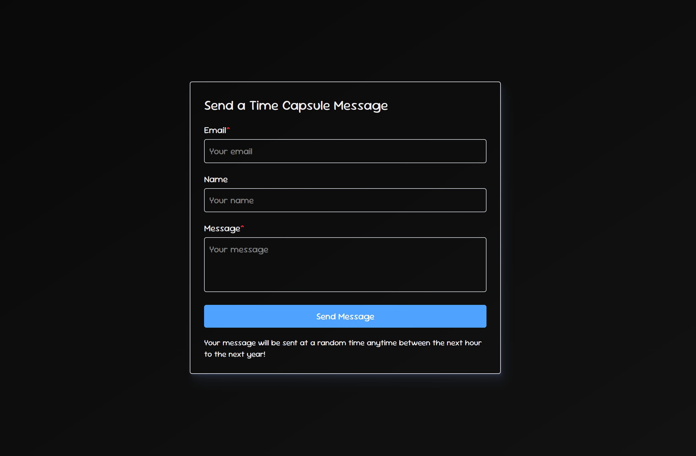

# Time Capsule - Send a message to your future self?

Yeah, so, I just wanted to create something that lets you write a message and have it delivered back to you at a completely random point in the future. Could be an hour from now, could be almost a year. You genuinely have no idea.

## How it works

Write a message, enter your email, hit send. We store it with a randomly scheduled send time. A cron job runs periodically (every hour), checks for any messages due to be sent, and fires them off as emails. That's it.

## General Framework

Frontend & Backend handled by Next, DB handled by Neon (serverless postgres), emails handled via nodemailer

## API Routes

```
POST /api/messages // Store message with a randomly scheduled send_at time
GET /api/cron/send // Cron endpoint - checks for due messages and sends them out
```

## Quick sneak peek


